# 📐 Wiki: Arquitectura 'Diamond Tier' — Atlas-TW [v1.8.3]

Estructura técnica de la cartografía de mazmorras mantenida por **DarckRovert**.

## 🏗️ Jerarquía del Sistema Atlas (Navigator Hierarchy)

Atlas-TW separa la lógica de visualización de la gestión de bases de datos masivas:

1.  **Hueso del Navigator (`TWAtlas/`)**: Gestiona la selección de mapas, coordenadas de bosses y el renderizado de la ventana principal.
2.  **Motor de Botín (`TWLoot/`)**: Es el módulo de datos más denso. Contiene las tablas con IDs de objetos y porcentajes de drop de Turtle WoW.
3.  **Puente de Misiones (`TWQuest/`)**: Interfaz asíncrona que se comunica con **pfQuest** para mostrar misiones activas en la mazmorra seleccionada.
4.  **Capa de Persistencia (`AtlasTWOptions.lua`)**: Almacena las preferencias de usuario y el estado del buscador.

---

## 🧭 Diagrama de Flujo: Carga de Datos v9.4

```mermaid
graph TD
    A[Evento: Apertura de Atlas] --> B[Carga de TWAtlas_Init]
    B --> C[Selección de Mazmorra]
    C --> D{¿Zona Custom?}
    D -- Sí --> E[Inyección de Mapas Séquito]
    D -- No --> F[Carga de Mapa Blizzard/Atlas]
    E --> G[Consulta de TWLoot Database]
    F --> G
    G --> H[Petición a pfQuest Linker]
    H --> I[Vincular Misiones de Instancia]
    I --> J[Render Final Diamond Tier HUD]
```

## ⚡ Estrategias de Ingeniería Diamond Tier

- **Selective Database Loading**: Solo se cargan en memoria los datos de la mazmorra actualmente seleccionada, liberando recursos del cliente 1.12.1.
- **Apex Skin Hook**: El AddOn detecta si pfUI está presente para aplicar capas de diseño coherentes con el resto del ecosistema del Séquito.
- **Turtle WoW ID Sync**: Las tablas de botín se sincronizan periódicamente con los parches del servidor para garantizar precisión absoluta.

---
© 2026 **DarckRovert** — El Séquito del Terror.
*Cartografía de élite para la conquista de Azeroth.*

